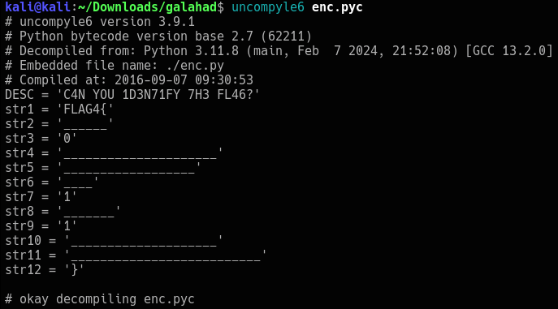

I've decided to take to doing some Vulnhub boxes for when I'm at campus. Much easier with campus WiFi, though a bit intensive on my battery running 2 VMs.

This is Galahad from DEFCON Toronto 2016. It's marked as an easy box, so let's take a crack at it!


## Let's enumerate:

```bash
PORT   STATE SERVICE VERSION
22/tcp open  ssh     OpenSSH 5.3 (protocol 2.0)
80/tcp open  http    Apache httpd 2.2.15 ((CentOS))
|_http-dombased-xss: Couldn't find any DOM based XSS.
|_http-stored-xss: Couldn't find any stored XSS vulnerabilities.
|_http-trace: TRACE is enabled
|_http-csrf: Couldn't find any CSRF vulnerabilities.
| http-slowloris-check: 
|   VULNERABLE:
|   Slowloris DOS attack
|     State: LIKELY VULNERABLE
|     IDs:  CVE:CVE-2007-6750
|       Slowloris tries to keep many connections to the target web server open and hold
|       them open as long as possible.  It accomplishes this by opening connections to
|       the target web server and sending a partial request. By doing so, it starves
|       the http server's resources causing Denial Of Service.
|       
|     Disclosure date: 2009-09-17
|     References:
|       http://ha.ckers.org/slowloris/
|_      https://cve.mitre.org/cgi-bin/cvename.cgi?name=CVE-2007-6750
|_http-server-header: Apache/2.2.15 (CentOS)
| http-enum: 
|   /admin/: Possible admin folder
|   /admin/index.html: Possible admin folder
|   /robots.txt: Robots file
|   /icons/: Potentially interesting folder w/ directory listing
|_  /staff/: Potentially interesting folder
```

Lots of interesting bits here. Let's run the site through Nikto.

```bash                                                                                                                   
- Nikto v2.5.0
---------------------------------------------------------------------------
+ Target IP:          192.168.65.129
+ Target Hostname:    192.168.65.129
+ Target Port:        80
+ Start Time:         2024-04-30 03:25:50 (GMT-4)
---------------------------------------------------------------------------
+ Server: Apache/2.2.15 (CentOS)
+ /: Server may leak inodes via ETags, header found with file /, inode: 798396, size: 1269, mtime: Fri Apr 28 12:41:16 2017. See: http://cve.mitre.org/cgi-bin/cvename.cgi?name=CVE-2003-1418
+ /: The anti-clickjacking X-Frame-Options header is not present. See: https://developer.mozilla.org/en-US/docs/Web/HTTP/Headers/X-Frame-Options
+ /: The X-Content-Type-Options header is not set. This could allow the user agent to render the content of the site in a different fashion to the MIME type. See: https://www.netsparker.com/web-vulnerability-scanner/vulnerabilities/missing-content-type-header/
+ /robots.txt: Entry '/staff/' is returned a non-forbidden or redirect HTTP code (200). See: https://portswigger.net/kb/issues/00600600_robots-txt-file
+ /robots.txt: contains 1 entry which should be manually viewed. See: https://developer.mozilla.org/en-US/docs/Glossary/Robots.txt
+ Apache/2.2.15 appears to be outdated (current is at least Apache/2.4.54). Apache 2.2.34 is the EOL for the 2.x branch.
+ OPTIONS: Allowed HTTP Methods: GET, HEAD, POST, OPTIONS, TRACE .
+ /: HTTP TRACE method is active which suggests the host is vulnerable to XST. See: https://owasp.org/www-community/attacks/Cross_Site_Tracing
+ /admin/: This might be interesting.
+ /staff/: This might be interesting.
+ /icons/: Directory indexing found.
+ /icons/README: Apache default file found. See: https://www.vntweb.co.uk/apache-restricting-access-to-iconsreadme/
+ /admin/index.html: Admin login page/section found.
+ /#wp-config.php#: #wp-config.php# file found. This file contains the credentials.
+ 8911 requests: 0 error(s) and 14 item(s) reported on remote host
+ End Time:           2024-04-30 03:27:51 (GMT-4) (121 seconds)
---------------------------------------------------------------------------
```

The binary just translates to:

```
Welcome

This is where the adventure begins -.-

DC416 Team

btw

no flag here;(
```

On the main page, inspect element lets us find a hidden Javascript file:
```js
var _0x4c9e = [
  "\x44\x43\x34\x31\x36",
  "\x73\x79\x6E\x74\x31\x7B\x7A\x30\x30\x61\x70\x34\x78\x72\x7D",
  "\x4E\x6F\x6E\x65",
  "\x70\x61\x72\x61\x74\x75\x3A",
  "\x6C\x6F\x67",
];
var CTF = _0x4c9e[0];
if (CTF == _0x4c9e[0]) {
  FLAG = _0x4c9e[1];
} else {
  FLAG = _0x4c9e[2];
}
console[_0x4c9e[4]](_0x4c9e[3]);
console[_0x4c9e[4]](FLAG);
```
Running it gives:

`synt1{z00ap4xr}`

Which is ROT13 encoded. Decoding it gives us:

`flag1{m00nc4ke}`

Yes! flag1!

Let's check out /admin/.

On /admin/, we see a link that says *Download* that leads to a .zip file named **enc.zip**.
It contains a .pyc file, which upon decompilation, brings us this:


The underscore represents a letter of the alphabet, eg. str1 is f as it is the 6th letter of the alphabet.
Continue on that note, and we have our second flag!

`flag4{f0urd1g1tz}`


